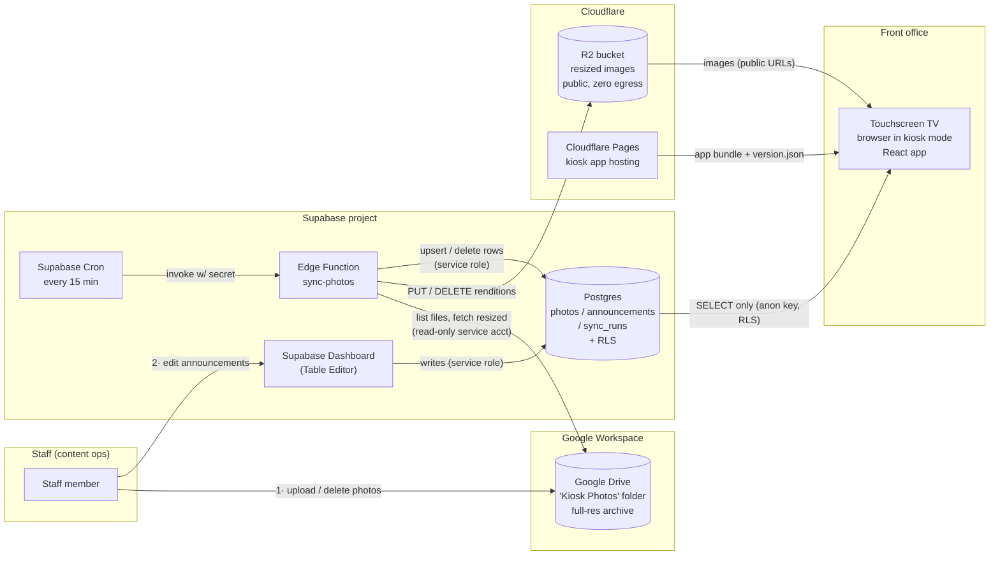
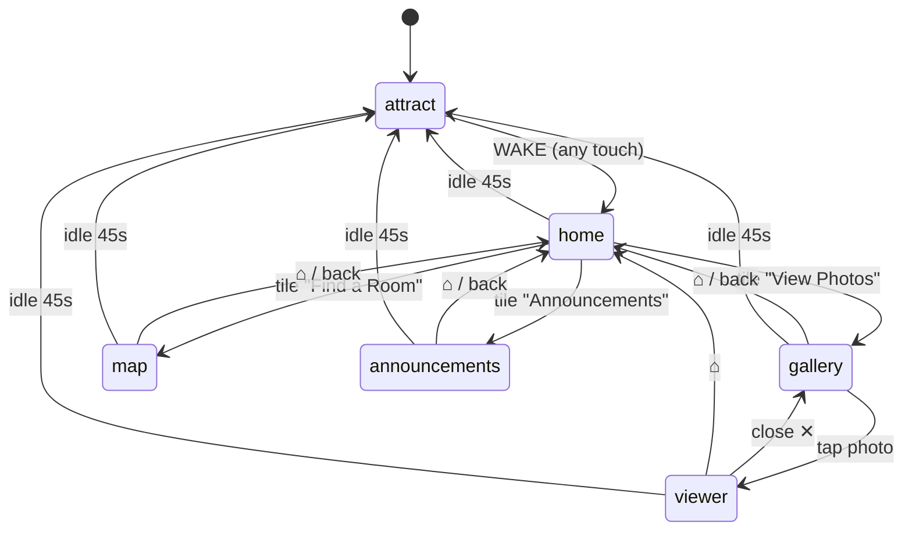

# Diamond Bar High School — Front Office Visitor Kiosk
## Project Planning Document

| | |
|---|---|
| **Status** | Draft v1.0 — for review |
| **Date** | July 2, 2026 |
| **Project** | Touchscreen visitor kiosk for the DBHS front office |
| **School** | Diamond Bar High School — Home of the Brahmas 🤘 (purple & gold) |
| **Target launch** | First day of the 2026–27 school year (assumed mid-August — **confirm exact date**) |

Throughout this document, values I've chosen on your behalf are marked **🔶 Suggested — confirm**. Every one of them is also collected in the [Decisions Register](#141-decisions-register-suggested-defaults-awaiting-confirmation) in §14 so you can approve or override them in one pass.

---

## Table of Contents

1. [Executive Summary](#1-executive-summary)
2. [Goals & Success Criteria](#2-goals--success-criteria)
3. [System Architecture](#3-system-architecture)
4. [Data Model](#4-data-model)
5. [Backend Spec — Sync Edge Function](#5-backend-spec--sync-edge-function)
6. [Frontend Spec](#6-frontend-spec)
7. [Map / Wayfinding Integration Plan](#7-map--wayfinding-integration-plan)
8. [Branding & Style Guide](#8-branding--style-guide)
9. [Hardware & Deployment Plan](#9-hardware--deployment-plan)
10. [Content Operations](#10-content-operations)
11. [Security Considerations](#11-security-considerations)
12. [Testing Plan](#12-testing-plan)
13. [Rollout Plan / Phased Timeline](#13-rollout-plan--phased-timeline)
14. [Open Questions & Risks](#14-open-questions--risks)
15. [Future Enhancements](#15-future-enhancements)
- [Appendix A: Staff Cheat Sheets (outlines)](#appendix-a-staff-cheat-sheets-outlines)

---

## 1. Executive Summary

The DBHS front office gets a steady stream of visitors — parents, district staff, vendors, substitute teachers, new students — who all need the same three things: a feel for campus life, directions to a room, and current school news. Today all three land on the front-office staff.

This project puts a **touchscreen kiosk** on the dedicated touch-TV in the front office that handles those three needs self-service:

1. **View Photos** — a rotating, always-fresh gallery of campus life, fed automatically from a Google Drive folder staff already know how to use.
2. **Find a Room** — an interactive campus map (reusing the SVG map component already built at `willtheranger.github.io/interactivemap`) with a searchable room list and a highlighted walking route from the front office.
3. **Announcements** — a scrollable feed of school news, edited directly by staff in a simple table.

When nobody is touching it, the kiosk becomes ambient signage: a full-screen photo carousel branded in Brahma purple and gold ("Touch anywhere to explore"). Any touch wakes the menu; 45 seconds of inactivity returns it to the carousel.

The system is deliberately cheap and low-maintenance: **Google Drive** (permanent photo archive, staff-facing) → **Supabase Edge Function** (scheduled sync + resize) → **Cloudflare R2** (zero-egress public image hosting) → **Supabase Postgres** (metadata, read-only to the kiosk) → **React kiosk app** in a locked-down full-screen browser. Everything fits comfortably inside free tiers, and staff never touch anything more technical than a Drive folder and a spreadsheet-like table editor.

---

## 2. Goals & Success Criteria

### 2.1 Goals

| # | Goal | Who benefits |
|---|------|--------------|
| G1 | Visitors can find any room on campus without asking staff | Visitors, front-office staff |
| G2 | Campus life is showcased with current photos, updated with zero technical effort | Visitors, school image, ASB/yearbook |
| G3 | School announcements are visible in the office without printing/posting paper | Staff, visitors |
| G4 | The kiosk runs unattended all day, every school day, and recovers on its own | IT, front office |
| G5 | Total recurring cost ≈ $0/month; no new paid subscriptions | School budget |
| G6 | Content operations require no developer: staff-only workflows for photos and announcements | Staff |

### 2.2 Success criteria — "done and working well" looks like

**For visitors:**
- A first-time visitor can go from the attract screen to seeing a highlighted route to a named room in **≤ 3 taps and under 15 seconds**, with no typing required.
- Every interactive element is comfortably tappable standing up (no missed taps, no precision required).
- The kiosk never shows a browser UI, error dialog, cursor, or blank screen to a visitor.

**For staff:**
- Dropping a photo into the Drive folder makes it appear on the kiosk **within 30 minutes** (two 15-minute sync cycles) with no further action.
- Deleting a photo from the Drive folder removes it from the kiosk within the same window (this is the takedown path — see §10.3).
- A trained staff member can post, edit, pin, or retire an announcement in **under 5 minutes** using the one-page cheat sheet (Appendix A).

**For IT / operations:**
- The kiosk survives: overnight power-down, a network outage (shows cached content), a browser crash (auto-relaunch), and a Windows/OS update (auto-login + auto-start).
- A full app update ships by pushing to `main` — nobody touches the physical device.
- 72-hour soak test passes with no memory growth beyond budget, no white screens, no manual intervention (§12.5).

**Hard requirements (non-negotiable for launch):**
- The kiosk browser session can **only read** data — verified by test that the anon key cannot INSERT/UPDATE/DELETE anything (§12.2).
- Idle timeout returns to the attract screen from **every** screen and resets all transient state (selected room, open photo, scroll position).
- Only photos cleared under the district's media-consent policy appear (§10.3, §11.5).

---

## 3. System Architecture

### 3.1 Components at a glance

| Component | Technology | Role | Cost |
|---|---|---|---|
| **Photo archive** | Google Drive shared folder | Staff-facing upload point; permanent full-resolution archive; source of truth for which photos are "in" | $0 (district Workspace) |
| **Sync worker** | Supabase Edge Function (Deno) on a schedule | Polls Drive, produces kiosk-sized renditions, uploads to R2, reconciles the `photos` table, enforces retention | $0 (free tier) |
| **Image hosting** | Cloudflare R2, public bucket | Serves resized images to the kiosk with zero egress fees | $0 (free tier) |
| **Database** | Supabase Postgres | `photos` metadata, `announcements` content, `sync_runs` log; RLS enforces read-only anon access | $0 (free tier) |
| **Scheduler** | Supabase Cron (pg_cron + pg_net) | Fires the sync function every 15 min 🔶 | $0 |
| **Kiosk app** | React (Vite) + Tailwind CSS, single-page, no router | Attract / Home / Photos / Map / Announcements; state machine + idle timer | $0 |
| **App hosting** | Cloudflare Pages 🔶 | Static hosting, auto-deploy from `main`, instant rollback | $0 |
| **Map component** | Existing SVG interactive map (`willtheranger.github.io/interactivemap`) | Embedded into the kiosk app for Find-a-Room (§7) | $0 |
| **Kiosk device** | Touchscreen TV + driving device running a browser in kiosk mode (§9) | The only piece of hardware | Already owned / small one-time |

🔶 **Suggested — confirm:** Cloudflare Pages for app hosting (keeps R2 + Pages on one Cloudflare account, free custom domains, preview deploys per branch). GitHub Pages would also work.

### 3.2 Architecture diagram



### 3.3 Data flows, end to end

**Flow A — a photo's life:**
1. Staff member drops `pep_rally.jpg` (full-res, maybe 8 MB HEIC from an iPhone) into the **Kiosk Photos** Drive folder. Optionally sets a caption in the file's *Description* field (§10.2).
2. On the next 15-minute tick, Supabase Cron POSTs to the `sync-photos` edge function with a shared secret.
3. The function lists the folder via the Drive API (read-only service account), computes the **desired set** = the newest `RETENTION_CAP` image files (🔶 200), and diffs it against the `photos` table.
4. `pep_rally.jpg` is new → the function obtains two kiosk renditions (display ≈ 1920 px, thumb ≈ 480 px — strategy in §5.4), PUTs them to R2 under deterministic keys, then upserts a row into `photos`.
5. The kiosk app refreshes its photo list the next time it enters the Attract state (and at most every 10 minutes 🔶); the new photo joins the carousel and gallery.
6. Months later the photo ages out of the newest-200 window → the next sync deletes its R2 objects and its row. **It still lives at full resolution in Drive forever** — the archive is never touched.

**Flow B — a takedown:** staff deletes (or moves out) the file in Drive → next sync sees it missing from the desired set → R2 objects and DB row deleted → gone from the kiosk within ~15–30 min. No developer involved.

**Flow C — an announcement:** staff opens the Supabase dashboard → Table Editor → `announcements` → adds a row (title, body, optional image URL) with `is_active = true`. The kiosk picks it up on its next data refresh. Unchecking `is_active` (or letting `expires_at` pass) retires it instantly — RLS filters it out server-side, so the kiosk *cannot even read* drafts or expired items (§4.3).

**Flow D — an app update:** developer merges to `main` → Cloudflare Pages builds and deploys → the build stamps a new `version.json` → the kiosk polls `version.json` each time it enters Attract and does a `location.reload()` when the version changes (§9.4). Worst case, the nightly 3 AM device reboot picks it up.

### 3.4 Why this shape (design rationale)

- **Drive as the staff interface** — zero training cost; staff already live in Drive; permissions ride on existing school Google accounts; the archive survives even if the whole kiosk stack is torn down.
- **R2 for images, not Supabase Storage** — R2's egress is free forever and its free tier (10 GB-month storage, 1M class-A / 10M class-B ops) dwarfs this workload; Supabase's free-tier bandwidth (≈5 GB/mo) could actually be dented by a kiosk cycling full-screen photos all day.
- **Postgres for metadata only** — the DB stays tiny (a few hundred rows), well under the 500 MB free-tier cap, and RLS gives an airtight read-only public surface.
- **Stateless, reconciling sync** (§5.3) — every run recomputes desired state from Drive and diffs; there's no incremental cursor to corrupt. A failed run costs nothing; the next run self-heals.
- **No routing library, no global state library** — one screen enum in the top component is the whole navigation model; a kiosk has no URLs, no back button, no deep links.

### 3.5 Capacity & free-tier budget (the math)

| Resource | Usage estimate | Free-tier limit | Headroom |
|---|---|---|---|
| R2 storage | 200 photos × (~400 KB display + ~60 KB thumb) ≈ **92 MB** | 10 GB-month | ~100× |
| R2 class-A ops (writes) | ~2–20 uploads/day × 2 renditions | 1M/month | vast |
| R2 class-B ops (reads) | 1 kiosk, heavy day ≈ a few thousand image GETs (mostly browser-cached) | 10M/month | vast |
| Supabase DB size | < 1 MB of rows | 500 MB | vast |
| Edge Function invocations | 4/hour × 24 × 31 ≈ **2,976/month** | 500K/month | ~170× |
| Supabase egress | JSON only (images come from R2) — a few MB/day | ~5 GB/month | large |
| Drive API queries | ~3–5 calls per sync ≈ 15K/month | 20K/100s rate limit | vast |
| Cloudflare Pages builds | a few per week | 500/month | vast |

⚠️ One real free-tier gotcha: **Supabase free projects pause after ~1 week with no activity.** During the school year the kiosk's own reads keep it alive; over **summer break with the kiosk powered off**, the project will pause and the kiosk will come back to a dead API in August. Mitigations in §14.3 (risk R9).

---

## 4. Data Model

### 4.1 Design notes (deltas from the starting-point schema)

Starting point was `photos (id, r2_url, caption, synced_at)` and `announcements (id, title, body, image_url, published_at, is_active)`. Refinements and why:

| Change | Why |
|---|---|
| `photos.drive_file_id text unique` | The idempotency key. The whole sync is a diff between Drive file IDs and this column; without it every run re-ingests everything. |
| Two renditions: `*_thumb` + `*_display` (keys **and** URLs) | Grid loads 480 px thumbs (fast, cheap); carousel/viewer loads 1920 px. Keys are canonical (needed for R2 deletes); URLs are a denormalized convenience for the frontend. If the public base URL ever changes (r2.dev → custom domain), one `UPDATE` rewrites them. |
| `photos.width / height` | Lets the grid and carousel reserve correct aspect-ratio boxes (no layout shift) and pick pan direction for the Ken Burns effect. Comes free from Drive's `imageMediaMetadata`. |
| `photos.drive_created_at` | Sort key ("newest uploads first") and the retention-window key. Upload time is more predictable for staff than EXIF taken-time. |
| `announcements.is_pinned` | Lets the office pin "Minimum day Friday" above older items without fighting dates. |
| `announcements.expires_at nullable` | Time-boxed items ("Picture day Oct 3") retire themselves; RLS hides them the second they lapse — nobody has to remember to un-publish. |
| `announcements.title` length check (≤ 80 chars) | Guards the kiosk card layout at the database level. |
| New table `sync_runs` | Observability: every sync writes one row (status, counts, error). "Why are photos stale?" is answered by a 5-second table peek, not log spelunking. Not readable by the kiosk. |
| `rooms` table — **deliberately deferred** | Room/route data likely ships as static JSON inside the map component for v1 (§7.4). Moving it into Postgres is a future enhancement once editing-by-staff matters. |

### 4.2 Schema DDL

```sql
-- ============================================================
-- Diamond Bar HS Kiosk — schema v1
-- Run as a Supabase migration (service role / dashboard SQL editor)
-- ============================================================

-- ---------- photos: kiosk-facing metadata for synced images ----------
create table public.photos (
  id               uuid primary key default gen_random_uuid(),
  drive_file_id    text not null unique,          -- idempotency / reconciliation key
  r2_key_display   text not null,                 -- e.g. photos/<drive_file_id>/display.jpg
  r2_key_thumb     text not null,                 -- e.g. photos/<drive_file_id>/thumb.jpg
  display_url      text not null,                 -- full public URL (denormalized)
  thumb_url        text not null,
  caption          text,                          -- from Drive file "description", nullable
  width            int,                           -- display-rendition pixel dims
  height           int,
  drive_created_at timestamptz not null,          -- Drive upload time; sort + retention key
  synced_at        timestamptz not null default now()
);

create index photos_feed_idx on public.photos (drive_created_at desc);

-- ---------- announcements: staff-edited, kiosk-read ----------
create table public.announcements (
  id           uuid primary key default gen_random_uuid(),
  title        text not null check (char_length(title) <= 80),
  body         text not null,
  image_url    text,                              -- optional; usually an R2 or Drive-hosted image
  is_pinned    boolean not null default false,
  is_active    boolean not null default true,
  published_at timestamptz not null default now(),
  expires_at   timestamptz,                       -- null = never expires
  created_at   timestamptz not null default now(),
  updated_at   timestamptz not null default now()
);

create index announcements_feed_idx
  on public.announcements (is_pinned desc, published_at desc)
  where is_active;

-- keep updated_at honest
create or replace function public.touch_updated_at()
returns trigger language plpgsql as $$
begin
  new.updated_at = now();
  return new;
end $$;

create trigger announcements_touch
  before update on public.announcements
  for each row execute function public.touch_updated_at();

-- ---------- sync_runs: one row per sync invocation (ops only) ----------
create table public.sync_runs (
  id             bigint generated always as identity primary key,
  started_at     timestamptz not null default now(),
  finished_at    timestamptz,
  status         text not null default 'running'
                   check (status in ('running','success','partial','failed')),
  photos_added   int not null default 0,
  photos_updated int not null default 0,
  photos_deleted int not null default 0,
  skipped        int not null default 0,          -- files skipped this run (see §5.5)
  error_detail   text                             -- first/most relevant error, truncated
);
```

### 4.3 Row Level Security & grants

Philosophy: the anon key that ships inside the kiosk bundle is treated as **fully public** (anyone could extract it). RLS + grants make that harmless: the anon role can `SELECT` exactly the two content tables — and for announcements, only rows that are *currently live*. Drafts, expired items, and the ops log are invisible at the API layer, not just hidden by frontend logic. All writes come from the service role (edge function, dashboard), which bypasses RLS by design.

```sql
-- Enable RLS everywhere (deny-by-default once enabled)
alter table public.photos        enable row level security;
alter table public.announcements enable row level security;
alter table public.sync_runs     enable row level security;   -- no policies → invisible to anon

-- Read policies for the kiosk
create policy "kiosk reads photos"
  on public.photos for select
  to anon
  using (true);

create policy "kiosk reads live announcements"
  on public.announcements for select
  to anon
  using (
    is_active
    and published_at <= now()
    and (expires_at is null or expires_at > now())
  );

-- Belt and braces: even with RLS, strip write privileges at the grant level
revoke insert, update, delete, truncate, references, trigger
  on all tables in schema public
  from anon, authenticated;

-- (No sequences/functions are exposed to anon in this schema; if any are added
-- later, revoke usage from anon there too.)
```

Verification tests for these policies are specified in §12.2 — they are launch blockers.

---

## 5. Backend Spec — Sync Edge Function

One edge function, `sync-photos`, does everything: ingest, resize, upload, reconcile, retention. It is **stateless and idempotent** — every invocation recomputes the desired state from Drive and converges the world (R2 + Postgres) toward it. There is no cursor, no "last sync token," nothing that can drift.

### 5.1 Scheduling & invocation

| Item | Spec |
|---|---|
| Trigger | Supabase Cron: `*/15 * * * *` 🔶 (every 15 min, 24/7 — ~2,976 invocations/month, 0.6% of free tier; not worth restricting to school hours) |
| Mechanism | `cron.schedule(...)` job using `pg_net` to `POST https://<project-ref>.supabase.co/functions/v1/sync-photos` |
| Auth | `Authorization: Bearer <service_role or function secret>` stored in **Supabase Vault**, referenced by the cron SQL — never inline in the schedule definition. The function additionally checks a custom `x-sync-secret` header against a `SYNC_SECRET` env var so a leaked function URL alone is useless. |
| Concurrency guard | On start, check for a `sync_runs` row with `status='running'` younger than 10 min → if found, exit immediately (`skipped` run). Prevents overlap if a run goes long. |
| Manual trigger | Same endpoint, invoked via `curl` with the secret — used in testing and in the staff runbook ("force a sync now"). |

Cron registration (run once, in the SQL editor — the Supabase dashboard's Cron UI generates equivalent SQL):

```sql
select cron.schedule(
  'sync-photos-every-15m',
  '*/15 * * * *',
  $$
  select net.http_post(
    url     := 'https://<project-ref>.supabase.co/functions/v1/sync-photos',
    headers := jsonb_build_object(
      'Content-Type',  'application/json',
      'Authorization', 'Bearer ' || (select decrypted_secret
                                     from vault.decrypted_secrets
                                     where name = 'sync_invoke_key'),
      'x-sync-secret', (select decrypted_secret
                        from vault.decrypted_secrets
                        where name = 'sync_shared_secret')
    ),
    body    := '{}'::jsonb
  );
  $$
);
```

### 5.2 Configuration (edge function secrets)

Set via `supabase secrets set` — never committed, never exposed to the frontend (§11.2):

| Secret | Contents |
|---|---|
| `GDRIVE_SA_KEY` | Google service-account JSON key (read-only Drive scope) — see §11.2 for provisioning |
| `GDRIVE_FOLDER_ID` | The Kiosk Photos folder ID |
| `R2_ACCOUNT_ID`, `R2_ACCESS_KEY_ID`, `R2_SECRET_ACCESS_KEY` | R2 S3-API token **scoped to the one bucket** |
| `R2_BUCKET` | e.g. `dbhs-kiosk-images` |
| `R2_PUBLIC_BASE` | e.g. `https://pub-xxxx.r2.dev` or `https://kiosk-img.<school-domain>` |
| `SYNC_SECRET` | Random 32+ char string; must match the `x-sync-secret` header |
| `RETENTION_CAP` | 🔶 `200` |
| `MAX_FILES_PER_RUN` | 🔶 `10` (bounds run time; backlog drains across runs — 200 photos ≈ 20 runs ≈ 5 hours worst case on first bulk load) |

(`SUPABASE_URL` / `SUPABASE_SERVICE_ROLE_KEY` are injected automatically into edge functions.)

### 5.3 Algorithm — exact steps per run

```
 1. AUTH GUARD      Verify x-sync-secret header. 401 if wrong.
 2. LOCK            If a 'running' sync_runs row < 10 min old exists → exit (skipped).
                    Insert sync_runs row (status='running').
 3. GOOGLE TOKEN    Mint an access token from GDRIVE_SA_KEY
                    (JWT grant, scope https://www.googleapis.com/auth/drive.readonly).
 4. LIST DRIVE      files.list, paginated:
                      q: '<FOLDER_ID>' in parents and trashed=false
                         and mimeType contains 'image/'
                      fields: id, name, description, mimeType, createdTime,
                              modifiedTime, md5Checksum, thumbnailLink,
                              imageMediaMetadata(width,height)
                    → driveFiles[]   (non-images and subfolders are ignored — v1
                      scans the top level only 🔶; see Decisions Register D13)
 5. DESIRED SET     desired = driveFiles sorted by createdTime desc,
                              take first RETENTION_CAP.
                    ── Retention IS this line. Files beyond the cap are simply
                       not in the desired set; the diff below removes them from
                       the kiosk. Nothing is ever deleted from Drive. Files that
                       were retention-removed earlier can't "come back" because
                       they're still outside the newest-N window. No tombstones,
                       no second bookkeeping system.
 6. CURRENT SET     SELECT drive_file_id, md5-ish fingerprint (modifiedTime)
                    FROM photos.
 7. DIFF            toAdd    = desired − current
                    toRemove = current − desired          (covers BOTH deletions
                                                           from Drive AND retention)
                    toUpdate = in both, but Drive modifiedTime ≠ stored
                                                           (photo was replaced/edited)
 8. INGEST          For each of toAdd ∪ toUpdate, oldest-first, capped at
                    MAX_FILES_PER_RUN:
                      a. Obtain display rendition (strategy §5.4): target long
                         edge 1920 px, JPEG/WebP, quality ~80.
                      b. Obtain thumb rendition: long edge 480 px.
                      c. PUT both to R2:
                           photos/<drive_file_id>/display.jpg
                           photos/<drive_file_id>/thumb.jpg
                         (deterministic keys → retry-safe, overwrite-safe)
                      d. UPSERT photos row ON CONFLICT (drive_file_id).
                         Row is written ONLY after both PUTs succeed, so the
                         kiosk never sees a URL that 404s.
                      Per-file failures: log, increment skipped, CONTINUE.
                      One bad file never blocks the batch (§5.5).
 9. REMOVE          For each toRemove:
                      a. DELETE both R2 objects.
                      b. DELETE the photos row — only after (a) succeeds, so a
                         failed object delete leaves the row for retry next run
                         (no orphaned R2 objects invisible to reconciliation).
10. FINALIZE        Update sync_runs row: status = success | partial (some
                    skipped) | failed (aborted), counts, finished_at,
                    error_detail (first error, truncated to ~500 chars).
```

Two properties worth calling out:

- **Deletion sync is a first-class feature, not an accident.** Because `toRemove` derives from "no longer in Drive," a staff member deleting a photo of a student whose media consent was revoked clears the kiosk in ≤ 30 min with no developer. This is the takedown path referenced in §2 and §10.3.
- **`MAX_FILES_PER_RUN` makes cold-start safe.** Seeding 200 photos on day one drains at 10/run × 4 runs/hour = 40/hour ≈ 5 hours. Acceptable; can be temporarily raised or manually re-triggered in a loop during initial load.

### 5.4 Image resizing strategy

This is the one place the environment pushes back: Supabase Edge Functions run Deno with **tight CPU budgets** (roughly 256 MB memory and ~2 s of CPU per request — verify current limits before build). Decoding and resizing a 12-megapixel JPEG in WASM can blow that budget.

🔶 **Suggested — confirm: Strategy A (Drive-side resizing) as primary, B as fallback.**

| Strategy | How | Pros | Cons |
|---|---|---|---|
| **A. Drive thumbnail endpoint (recommended)** | Drive's `files.list` returns a `thumbnailLink` (a signed `lh3.googleusercontent.com` URL ending in `=s220`). Rewrite the size suffix — `=s1920` / `=s480` — and fetch. Google does the resize server-side. | Near-zero CPU in the function (pure I/O); handles **HEIC → JPEG** conversion and **EXIF rotation** for free; fast | Semi-documented behavior (low risk, widely used, but Google could change it); links are short-lived (fetch immediately, never store); brand-new uploads may briefly lack a thumbnail → skip & retry next run |
| **B. Download + WASM resize (fallback)** | `files.get?alt=media` for full bytes, resize with a pure-WASM lib (e.g. ImageScript or magick-wasm) | Fully documented APIs; exact quality control | CPU-heavy: risks the ~2 s CPU cap on large images; HEIC decode support is poor in WASM (HEIC files might have to be skipped with a staff note: "export as JPEG") |
| **C. Move sync to a Cloudflare Worker** | Same algorithm, Workers Cron Trigger, native R2 binding | Generous CPU on paid tier; R2 same-platform | Departs from the chosen Supabase-centric design; only reach for this if A and B both disappoint |

Implementation rule: try A; if `thumbnailLink` is missing or the fetch fails, fall back to B for that file; if B exceeds limits, skip the file, count it in `skipped`, and let §5.5's escalation surface it. Store the *actual* output dimensions in `width`/`height` (from the fetched bytes, not Drive metadata).

### 5.5 Error handling matrix

Guiding principle: **per-file isolation, run-level honesty.** A bad file never kills a run; a dead dependency kills the run loudly (`failed`) and the next run retries from scratch — statelessness means there is nothing to repair.

| Failure | Detection | Handling | Kiosk-visible effect |
|---|---|---|---|
| Drive API unreachable / 5xx | fetch error / status | Abort run → `status='failed'`, `error_detail` set. Next run retries. | None — kiosk keeps serving current content |
| Service-account auth fails (revoked key, clock skew) | token endpoint error | Abort run, `failed`. This one won't self-heal → escalation below. | None immediately; photos go stale |
| `thumbnailLink` missing (fresh upload) | field absent | Try Strategy B; else skip file (`skipped++`), retry next run — Drive usually has the thumbnail within minutes | Photo appears one cycle later |
| Resize fails / corrupt or unsupported image / oversized | decode error, CPU guard | Skip file, `skipped++`, list filename in `error_detail`, `status='partial'`. File will be re-attempted each run — if it's permanently bad it shows up as a persistent `partial` (see escalation). | That photo never appears |
| R2 PUT fails | S3 error / non-2xx | Retry ×3 with backoff (1 s / 2 s / 4 s) within the run; then skip file. **No DB row is written** (rule 8d) → no broken image on the kiosk. Deterministic keys make the eventual retry clean. | Photo delayed |
| DB upsert fails | Postgres error | Log, skip; renditions already in R2 are harmless orphans that the next successful upsert adopts (same keys). | Photo delayed |
| R2 DELETE fails during removal | S3 error | Keep the DB row (rule 9b), retry next run. | Removed photo lingers ≤ one extra cycle |
| Function crashes mid-run | `sync_runs` row stuck `running` | 10-min staleness check in step 2 lets the next run proceed; stuck row is overwritten to `failed` by a small cleanup in step 2. | ≤ 15 min delay |
| Cron itself stops firing | No new `sync_runs` rows | Caught by the ops runbook check (§9.6) and the escalation below | Photos stale |

**Escalation (v1 = pragmatic):** no paging. Two cheap detectors:
1. The runbook (§9.6): "photos stale?" → look at `sync_runs` — the status/error columns say exactly what broke.
2. 🔶 A second tiny scheduled function (or the same one, on a daily schedule) that checks "any `success` in the last 24 h?" and, if not, emails the developer via a free transactional-email API. Nice-to-have; can land post-launch (§15).

### 5.6 Function skeleton (shape, not final code)

```ts
// supabase/functions/sync-photos/index.ts  (Deno)
import { createClient } from "npm:@supabase/supabase-js@2";
import { AwsClient } from "npm:aws4fetch";          // S3-compatible signing for R2

Deno.serve(async (req) => {
  if (req.headers.get("x-sync-secret") !== Deno.env.get("SYNC_SECRET"))
    return new Response("forbidden", { status: 401 });

  const db = createClient(Deno.env.get("SUPABASE_URL")!, Deno.env.get("SUPABASE_SERVICE_ROLE_KEY")!);
  const run = await startRun(db);                    // steps 1–2: lock + sync_runs row
  if (!run) return json({ skipped: "already running" });

  try {
    const token      = await googleToken();          // step 3: SA JWT → access token
    const driveFiles = await listFolderImages(token);// step 4 (paginated)
    const desired    = newestN(driveFiles, cap());   // step 5: retention IS the window
    const current    = await currentPhotos(db);      // step 6
    const { toAdd, toUpdate, toRemove } = diff(desired, current); // step 7

    const r2 = new AwsClient({ accessKeyId: env("R2_ACCESS_KEY_ID"),
                               secretAccessKey: env("R2_SECRET_ACCESS_KEY") });

    let added = 0, updated = 0, skipped = 0;
    for (const f of [...toAdd, ...toUpdate].slice(0, maxPerRun())) {   // step 8
      try {
        const display = await rendition(f, 1920, token);   // §5.4: A then B
        const thumb   = await rendition(f, 480, token);
        await putR2(r2, keyFor(f, "display"), display);
        await putR2(r2, keyFor(f, "thumb"), thumb);
        await upsertPhoto(db, f, display, thumb);          // only after both PUTs
        toAdd.includes(f) ? added++ : updated++;
      } catch (e) { skipped++; noteError(run, f, e); }     // isolation: continue
    }

    let deleted = 0;
    for (const row of toRemove) {                          // step 9
      try {
        await deleteR2(r2, row.r2_key_display, row.r2_key_thumb);
        await deletePhoto(db, row.id);                     // row last
        deleted++;
      } catch (e) { noteError(run, row, e); }
    }

    await finishRun(db, run, { added, updated, deleted, skipped }); // step 10
    return json({ added, updated, deleted, skipped });
  } catch (e) {
    await failRun(db, run, e);
    return json({ error: String(e) }, 500);
  }
});
```

---

## 6. Frontend Spec

### 6.1 Stack & structural rules

- **React 18 + Vite + Tailwind CSS.** TypeScript 🔶 (strongly suggested — the state machine and data contracts benefit enormously; near-zero cost in a greenfield app).
- **No routing library.** Navigation is a `screen` enum in the top-level component, driven by a reducer. A kiosk has no URLs, no history, no deep links — a router would only add ways to end up somewhere unintended.
- **No global-state library.** Two data hooks (`usePhotos`, `useAnnouncements`) + one reducer cover everything.
- **`@supabase/supabase-js`** with the anon key (public by design, §11.1) for reads. **Zero write code paths exist in the bundle.**
- Data libraries kept minimal: 🔶 `embla-carousel-react` for the swipeable viewer (tiny, touch-first); everything else hand-rolled.

### 6.2 Screens

#### S0 — Attract (default / idle state)
The kiosk's resting face; matches the approved mockup (left panel).
- Full-bleed photo carousel: crossfade every **8 s** 🔶 with a slow Ken Burns drift (scale 1.00 → 1.06 over the dwell; pan axis chosen from the photo's aspect ratio). Order **shuffled once per cycle** 🔶 so the office isn't watching the same loop all day.
- Persistent overlay per the mockup: Brahma bull mark + "DIAMOND BAR / HIGH SCHOOL" lockup top-center; bottom band with touch icon + "TOUCH ANYWHERE TO EXPLORE" between gold rules; subtle dark gradient scrims top/bottom for legibility over any photo. No captions here 🔶 (keep it ambient).
- Behavior: any `pointerdown` → `HOME`. On **entering** Attract: refresh data (§6.6), check `version.json` (§9.4), preload the first 3 carousel images.
- Photosensitivity: crossfades ≥ 800 ms, no flashing, no fast motion.

#### S1 — Home
Matches the approved mockup (right panel).
- Header bar: bull mark + school lockup on deep purple.
- Three large tiles (purple, gold border, white icon + label): **View Photos** / **Find a Room** / **Announcements**. Tiles are the mockup's design: rounded ~20 px, icon centered, gold underline rule, label ≥ 28 px.
- Footer motto: "HOME OF THE BRAHMAS" between gold rules.
- Tap tile → corresponding screen. Idle 45 s → Attract.

#### S2 — Gallery (photo grid)
- Header: back-to-Home button (large, left), title "Photos", school mark right.
- Responsive grid of **thumb renditions**: 4 columns at 1920×1080 🔶, 16 px gutters, aspect-preserving tiles (CSS `aspect-ratio` from stored `width/height` — zero layout shift). Newest first.
- Native momentum touch scroll (`overflow-y: auto; overscroll-behavior: contain`), `loading="lazy"` on tiles. 200 thumbs ≈ 12 MB worst case, lazily fetched and browser-cached — fine.
- Tap photo → Viewer at that index.

#### S3 — Photo Viewer (full-screen overlay over Gallery)
- Black backdrop, **display rendition** centered/contained.
- **Swipe left/right** (embla) to move through the gallery order; adjacent images preloaded both directions.
- Controls (all ≥ 72 px): close ✕ top-right → Gallery; left/right chevrons (for visitors who don't discover swiping); position indicator "12 / 200" bottom-center.
- Caption (if present) in a bottom scrim, single line, 22 px.
- Tap on empty backdrop toggles controls visibility 🔶 (clean viewing).

#### S4 — Find a Room (map)
Full spec in §7. Layout summary: left panel (~30% width) with **browse-first room finding** (category chips + alphabet rail — deliberately **no text input** in v1 🔶, see §7.3); right ~70% the interactive SVG map. Selecting a room highlights it, draws the route from the front office ("You are here" marker), and shows an info card (room number, name, wing, walking hint). "Clear" resets. Exit via Home button; idle → Attract also fully resets map state.

#### S5 — Announcements
- Single centered column (max ~900 px) of cards, matching mockup card language: white card, purple title (≤ 80 chars by DB constraint), 20–22 px body, optional image (top, rounded), date line ("Posted June 12").
- **Pinned items first** with a small gold "PINNED" chip, then newest-first.
- Native touch scroll. No pagination — RLS already caps the feed to live items; if the feed grows unwieldy the office should retire items (content guidelines, §10.4).
- Empty state: friendly card — "No announcements right now — check back soon!"

#### Shared chrome
Every non-Attract screen shows a persistent bottom-left **⌂ Home** button (≥ 96 px wide) and the header back affordance where applicable. Every screen obeys the idle timer.

### 6.3 Component tree

```
<App>                         state machine (useReducer) + useIdleTimer + data hooks
│                             renders exactly one screen by `state.screen`
├── <AttractScreen>
│   └── <AmbientCarousel>     crossfade + Ken Burns, shuffled playlist
├── <HomeScreen>
│   ├── <KioskHeader>         bull mark + lockup (shared)
│   ├── <MenuTile> ×3         icon, label, gold border, tap ripple
│   └── <MottoFooter>         "HOME OF THE BRAHMAS"
├── <GalleryScreen>
│   ├── <ScreenHeader>        back + title (shared)
│   └── <PhotoGrid>
│       └── <PhotoThumb> ×N
├── <PhotoViewer>             overlay; embla swipe, chevrons, close, caption, counter
├── <MapScreen>
│   ├── <ScreenHeader>
│   ├── <RoomFinderPanel>     category chips + A–Z rail + result list
│   ├── <InteractiveMap>      the existing SVG map component (§7)
│   └── <RoomInfoCard>        selected room details + "route shown" hint
├── <AnnouncementsScreen>
│   ├── <ScreenHeader>
│   └── <AnnouncementCard> ×N
└── <HomeButton>              persistent ⌂ on all non-Attract screens
```

### 6.4 State machine

State shape:

```ts
type Screen = "attract" | "home" | "gallery" | "viewer" | "map" | "announcements";

interface KioskState {
  screen: Screen;
  viewerIndex: number | null;   // gallery position when screen === "viewer"
}

type KioskEvent =
  | { type: "WAKE" }                        // any touch on Attract
  | { type: "SELECT_TILE"; tile: "gallery" | "map" | "announcements" }
  | { type: "OPEN_PHOTO"; index: number }
  | { type: "CLOSE_VIEWER" }
  | { type: "GO_HOME" }
  | { type: "IDLE_TIMEOUT" };
```

Transition table (rows = current state; `·` = ignored):

| State ↓ / Event → | WAKE | SELECT_TILE | OPEN_PHOTO | CLOSE_VIEWER | GO_HOME | IDLE_TIMEOUT |
|---|---|---|---|---|---|---|
| **attract** | → home | · | · | · | · | · (already home base) |
| **home** | · | → gallery / map / announcements | · | · | · | → attract |
| **gallery** | · | · | → viewer (set index) | · | → home | → attract |
| **viewer** | · | · | · (swipe is internal) | → gallery | → home | → attract |
| **map** | · | · | · | · | → home | → attract |
| **announcements** | · | · | · | · | → home | → attract |

Rules that apply across the table:
- **`IDLE_TIMEOUT` resets everything.** Entering `attract` clears `viewerIndex`, the map's selected room/route, and all scroll positions (screens unmount — reset is free). The next visitor always starts clean.
- **Transition debounce:** ignore navigation events for **300 ms** after any transition 🔶 — a palm producing multiple `pointerdown`s must not double-navigate (e.g., Attract → Home → accidental tile).
- Screen changes use a fast fade (~200 ms); nothing bouncy.

Same machine as a diagram:



### 6.5 Idle timeout — detailed behavior

- **Duration: 45 s** 🔶 of no touch, on every screen except Attract. (Stated in the UX flow; flagged here because it's tunable. Worth revisiting after pilot: the map screen may deserve 90 s — a visitor studying a route isn't touching the screen. See Decisions Register D2.)
- **Activity =** any `pointerdown`, `pointermove`, `wheel`, or `keydown` (keyboard events only matter in dev). `pointermove` is included so a finger tracing the map without lifting still counts.
- On timeout: dispatch `IDLE_TIMEOUT` → `attract`. No warning countdown in v1 🔶 (a 45 s window doesn't warrant one; a "Still there?" toast is listed in §15).
- Implementation:

```ts
function useIdleTimer(timeoutMs: number, onIdle: () => void, enabled: boolean) {
  const idle = useRef(onIdle);
  idle.current = onIdle;

  useEffect(() => {
    if (!enabled) return;
    let t: number;
    const arm = () => { clearTimeout(t); t = window.setTimeout(() => idle.current(), timeoutMs); };
    const evts = ["pointerdown", "pointermove", "wheel", "keydown"] as const;
    evts.forEach(e => window.addEventListener(e, arm, { passive: true }));
    arm();
    return () => { clearTimeout(t); evts.forEach(e => window.removeEventListener(e, arm)); };
  }, [timeoutMs, enabled]);
}

// in <App>:  useIdleTimer(45_000, () => dispatch({ type: "IDLE_TIMEOUT" }), state.screen !== "attract");
```

### 6.6 Data layer

- **Fetch:** `usePhotos()` → `photos` ordered by `drive_created_at desc`; `useAnnouncements()` → RLS-filtered feed ordered by `is_pinned desc, published_at desc`.
- **Refresh triggers:** (1) app boot; (2) **every entry into Attract** — the natural "between visitors" moment, guaranteeing content is at most one idle-cycle stale; (3) a 10-minute interval 🔶 as a backstop for long quiet periods; (4) the browser `online` event after an outage.
- **Cache:** last-good responses persisted to `localStorage` (stale-while-revalidate). On boot with the network down, the kiosk renders cached data immediately instead of an empty shell. Images additionally ride the normal HTTP cache (R2 sends long `Cache-Control`; keys are content-addressed by file id so staleness isn't a concern).
- **Failure posture:** a failed refresh is silent — keep showing current data. If *no* data exists at all (first boot, no network), show a branded "One moment — reconnecting…" panel rather than a broken UI. No error text ever faces a visitor.

### 6.7 Kiosk-mode hardening (in-app)

```css
/* global.css — kiosk lockdown */
* { -webkit-user-select: none; user-select: none; }
html { cursor: none; overscroll-behavior: none; }
body { touch-action: manipulation; }   /* kills double-tap zoom; pinch handled below */
img  { -webkit-user-drag: none; }
```

```html
<meta name="viewport"
      content="width=device-width, initial-scale=1, maximum-scale=1, user-scalable=no" />
```

```ts
// index.tsx — belt & braces with the Chrome flags in §9.3
window.addEventListener("contextmenu", e => e.preventDefault());
document.addEventListener("gesturestart", e => e.preventDefault()); // Safari-style pinch, just in case
```

- Pinch-zoom is disabled globally (viewport + `touch-action` + Chrome `--disable-pinch`); the **map implements its own zoom** via on-screen ＋/− buttons and manually-handled gestures inside its own container (§7.3) — browser zoom stays off everywhere.
- Fullscreen comes from the browser's kiosk mode (§9.3), not the Fullscreen API — no user gesture required, survives reboots.

---

## 7. Map / Wayfinding Integration Plan

### 7.1 What exists today

An SVG-based interactive campus map component, built separately and live at `willtheranger.github.io/interactivemap`. This plan treats it as a working rendering/interaction layer whose **integration contract is the thing to design**. Its internals (framework, build setup, data format) need a quick audit — that audit is Phase 0 work (§13) because it decides the integration route below.

### 7.2 Integration options

| Option | How | Pros | Cons | When to choose |
|---|---|---|---|---|
| **A. Source-merge (recommended 🔶)** | Copy the map component's source into this repo (e.g. `src/map/`), adapt to props-driven React component | One build, one deploy; shared Tailwind theme; direct function calls (no bridge); easiest state reset on idle | One-time port effort if its stack differs from React/Vite | If the map is React or plain TS/JS SVG manipulation (most likely) |
| B. Package dependency | Publish the map as an npm/git package; kiosk imports it | Map stays independently reusable | Version-sync overhead for a two-project ecosystem; slows iteration during the integration crunch | If the map must keep shipping separately at github.io |
| C. `<iframe>` + `postMessage` | Embed the deployed map page; bridge commands/events | Zero porting; total isolation; fastest to demo | A protocol to design anyway (select/highlight/reset/ready); double-loading fonts/styles; idle-reset and offline behavior harder to guarantee | If the stack audit finds a mismatch (e.g. it's Svelte/vanilla with its own build) or time runs short — an acceptable v1 escape hatch |

Even under C, the **data contract below is identical** — it just travels over `postMessage` instead of props.

### 7.3 Kiosk-specific UX decisions

- **Browse-first, no typing (v1)** 🔶. On-screen keyboards in kiosk browsers are unreliable (Windows OSK doesn't pop in kiosk Chrome without extra config) and typing is the slowest kiosk input anyway. Instead:
  - **Category chips**: Administration · Classrooms · Gym / Athletics · Library · Performing Arts · Counseling · Food Services … (final list from the room audit)
  - **A–Z / number rail**: tap "2" → all 200-wing rooms; tap "L" → Library, etc.
  - A custom on-screen keyboard for free-text search is a v2 enhancement (§15) if pilot feedback demands it.
- **Fixed origin**: the kiosk never moves. "You are here" is permanently the front office — a pulsing gold marker.
- **Route display**: highlighted room polygon (gold fill pulse) + route polyline (gold, ~6 px, animated draw over ~800 ms, arrowhead at destination) + info card: room number, name, wing/building, and a one-line hint ("Exit the office, turn left, second hallway on the right").
- **Map gestures**: pan by drag inside the map container; zoom via ＋/− buttons (min/max clamped) and optionally a manually-implemented two-finger pinch **inside the SVG container only** (`touch-action: none` on the container; gesture math in JS). Browser-level zoom stays disabled globally. "Reset view" button re-centers.
- **Idle reset**: leaving the screen (Home or idle) clears selection, route, pan, and zoom — free if the component is fully props/state-driven and unmounts.
- **Hit targets**: small rooms get invisible padded hit areas (transparent expanded stroke or overlay rects) so every room is tappable at finger size (§8.4).

### 7.4 Data contract

```ts
/** rooms.json — one entry per findable destination */
interface Room {
  id: string;                 // stable slug, e.g. "room-214"
  number: string | null;      // "214" (null for e.g. "Main Gym")
  name: string;               // "Chemistry Lab" / "Main Gym"
  aliases: string[];          // ["chem lab", "science 214"] — powers chip/rail matching
  category: "admin" | "classroom" | "athletics" | "library" | "arts"
          | "counseling" | "food" | "facility";
  wing: string;               // "200 Wing" / "Administration" — grouping label
  svgElementId: string;       // id/data-attr of the room shape in the SVG
  floor?: 1 | 2;              // only if the audit finds multi-story buildings
}

/** routes.json — precomputed, fixed-origin (see below) */
interface RouteSet {
  origin: "front-office";
  routes: Record<Room["id"], string>;  // SVG polyline/path data, drawn in map coords
}

/** Component contract (props under Option A; message protocol under C) */
interface InteractiveMapProps {
  selectedRoomId: string | null;   // highlights room + draws its route
  onRoomTap: (roomId: string) => void;
  onReady?: () => void;
}
```

**Routing recommendation 🔶 — precompute, don't pathfind.** Because the origin is permanently the front office, wayfinding does not need a graph algorithm: each room needs exactly **one hand-authored (or hand-corrected) polyline** from the front office. Authoring ~N polylines is a content task, not an engineering one, and hand-drawn routes can encode real-world knowledge (preferred visitor corridors, "not through the staff lounge") that Dijkstra over an SVG can't. A corridor node-graph with A* stays in the future-enhancements drawer (§15) for when origins multiply (second kiosk) — and can reuse the same `routes` interface.

Practical authoring shortcut: routes for rooms on the same corridor share a trunk polyline and differ only in the last segment — author trunk paths per wing, then branch. Expect the real effort to be the **room audit**, not the drawing.

### 7.5 What the map needs from the school (inputs)

| Input | Owner | Notes |
|---|---|---|
| Authoritative room list (number, name, category) | Front office / facilities | The **room audit** — count unknown (🔶 assume ~80–150 findable destinations for planning; confirm). Include visitor-relevant non-classrooms: restrooms, nurse, attendance window, theater box office. |
| Which destinations matter for v1 | Front office | 🔶 Suggest v1 = *every* findable destination if the audit is easy, else top ~40 visitor destinations first, rest in a fast-follow |
| Campus changes since the SVG was drawn | Facilities | Portables added/removed, renamed labs, construction detours |
| Any second-story spaces | Facilities | Decides whether `floor` + a floor toggle + "take the stairs" hints are needed at all |

### 7.6 Still undecided (tracked in §14)

- Map component's actual stack → picks Option A vs C (Phase 0 audit).
- Room audit size and v1 coverage cut.
- Multi-floor handling (pending audit).
- Whether room/route data stays as static JSON in the repo (🔶 suggested for v1 — versioned, reviewable, no staff editing expected) or moves into a Supabase `rooms` table (future, if staff need to edit labels without a deploy).

---

## 8. Branding & Style Guide

### 8.1 Principles

Purple-and-gold pride, flat and modern, **legible from a meter away, tappable without aiming.** The approved mockup is the visual source of truth; this section turns it into tokens and rules.

### 8.2 Color palette

⚠️ Hex values below are **sampled from the approved mockup** — 🔶 confirm against official school/district brand assets (athletics or ASB usually holds the canonical purple/gold) before freezing tokens.

| Token | Hex | Usage |
|---|---|---|
| `brahma-900` | `#2A1B4E` | Darkest purple — gradient ends, photo scrims |
| `brahma-700` | `#3D2870` | Tile fill, header bar (mockup's tile purple) |
| `brahma-600` | `#4B2E83` | Primary purple — headers, titles, buttons |
| `brahma-400` | `#7A5FC7` | Focus/pressed states, subtle accents |
| `gold-500` | `#D9A72E` | Primary gold — borders, rules, icons, highlights |
| `gold-300` | `#EFC75E` | Gold hover/pulse highlights, route glow |
| `gold-700` | `#8F6E1A` | Gold **text on light backgrounds** (contrast-safe) |
| `surface` | `#F6F4F0` | App background (mockup's warm off-white) |
| `card` | `#FFFFFF` | Card backgrounds |
| `ink` | `#1D1633` | Primary text on light |
| `ink-muted` | `#6B6478` | Secondary text, dates |

Contrast rules (WCAG AA, and a kiosk is viewed at arm's length — don't cut corners):

| Pair | Approx. ratio | Verdict |
|---|---|---|
| White on `brahma-700` | ≈ 11:1 | ✅ any size |
| `gold-500` on `brahma-700` | ≈ 5.5:1 | ✅ large text / icons / rules (its only use) |
| `ink` on `card`/`surface` | ≈ 14:1 | ✅ any size |
| `gold-500` on white | ≈ 2.2:1 | ❌ **never for text** — use `gold-700` (≈ 5.6:1) |
| `ink-muted` on `card` | ≈ 5.4:1 | ✅ ≥ 18 px only |

```js
// tailwind.config.js (excerpt)
export default {
  theme: {
    extend: {
      colors: {
        brahma: { 400: "#7A5FC7", 600: "#4B2E83", 700: "#3D2870", 900: "#2A1B4E" },
        gold:   { 300: "#EFC75E", 500: "#D9A72E", 700: "#8F6E1A" },
        surface: "#F6F4F0", ink: { DEFAULT: "#1D1633", muted: "#6B6478" },
      },
      fontFamily: {
        display: ["Montserrat", "system-ui", "sans-serif"],
        body:    ["Inter", "system-ui", "sans-serif"],
      },
    },
  },
};
```

### 8.3 Typography

🔶 **Suggested — confirm** (mockup shows a bold, wide-tracked sans lockup; exact face wasn't specified):

| Role | Face | Notes |
|---|---|---|
| Display / lockups / tile labels | **Montserrat** ExtraBold & Bold | Uppercase for lockups & mottos with wide tracking (`tracking-[0.18em]`), matching the mockup's "DIAMOND BAR" / "HOME OF THE BRAHMAS" treatment |
| Body / UI | **Inter** Regular & SemiBold | Workhorse for cards, lists, captions |

**Self-host both** (`@fontsource/montserrat`, `@fontsource/inter`) — no Google Fonts CDN call, so typography survives content filters and network blips (§9.5).

Type scale (1920×1080 landscape, viewed standing at ~0.5–1 m):

| Style | Size / weight | Used for |
|---|---|---|
| Display XL | 64 px / 800 / caps, tracked | Attract lockup |
| Display L | 40 px / 800 | Screen titles |
| Tile label | 30 px / 700 | Home tiles |
| Card title | 28 px / 700 | Announcement titles, room names |
| Body | 22 px / 400–500 | Announcement body, info cards |
| Secondary | 18 px / 500 / `ink-muted` | Dates, counters, hints — **18 px is the floor**; nothing smaller anywhere |

### 8.4 Touch sizing & spacing (the kiosk rules)

| Rule | Value |
|---|---|
| Minimum tap target | **64 × 64 px** (hard floor 48 px for dense list rows only) |
| Minimum gap between adjacent targets | 16 px (24 px preferred) |
| Home tiles | ≥ 280 × 320 px |
| Primary buttons (⌂ Home, Back, ✕) | ≥ 96 px wide, 72 px tall |
| List rows (room finder) | ≥ 72 px tall, full-row tappable |
| Spacing scale | Tailwind default 8-px grid; screen gutters 48 px; card padding 24–32 px |
| Corner radius | 20 px cards/tiles (mockup), 12 px buttons/chips |
| Elevation | Flat design: 1 px borders (gold on purple, `#E5E1DA` on light) + at most one soft shadow level — no deep shadow stacks |
| Feedback | Every tappable thing responds < 100 ms: pressed state = 4% darken + scale 0.98. No hover states anywhere (there is no hover on a kiosk). |
| Placement | All interactive controls in the lower ⅔ of the screen where possible; combined with mounting height (§9.1) this keeps controls within ADA reach (operable parts ≤ 48″ from the floor) |

### 8.5 Iconography, imagery, motion, voice

- **Icons**: one consistent outline set 🔶 (suggest [Lucide]) at 3 px stroke, white on purple / `brahma-600` on light. The three tile icons follow the mockup: photos / map-pin / megaphone.
- **Brahma bull mark**: needed as **SVG vector** — flagged as an asset-handoff item in §14.2 (Q8). Never stretch a raster screenshot of it.
- **Imagery**: full-color photography only (no duotone filters over student faces); scrims (`brahma-900` at 40–60%) behind any text-over-photo.
- **Motion**: 150–250 ms ease-out for UI transitions; the only slow motion is the Attract Ken Burns. Nothing loops aggressively; no flashing (photosensitivity).
- **Voice/tone**: warm, brief, proud. "Welcome to Brahma Country." Sentence case for UI text; reserved uppercase for brand lockups and mottos. No exclamation-point pileups.

---

## 9. Hardware & Deployment Plan

### 9.1 Physical setup

- **Display**: the existing dedicated interactive touchscreen TV, landscape, designed against **1920 × 1080** 🔶 (layout in relative units, so 4K panels just render sharper).
- **Mounting**: screen center ≈ 54–58″ from floor with interactive controls (lower ⅔ of UI) falling at or below **48″** — ADA side-reach max for operable parts. Confirm final height with facilities against the actual panel size.
- **Placement**: visible from the office entrance, not blasted by window glare (verify on-site — §12.6), near power + Ethernet.
- **Physical security**: driving device locked inside the TV cabinet or a mount enclosure; no keyboard/mouse left attached; USB ports inaccessible to the public.

### 9.2 Driving device — decision needed

The TV needs something to run the browser. 🔶 **Recommendation: Option 1 if district IT manages Chrome devices (school runs Google Workspace, so likely); otherwise Option 2.** Decide in Phase 0.

| Option | What | Pros | Cons |
|---|---|---|---|
| **1. ChromeOS device in managed kiosk mode** | Chromebox/ChromeOS Flex box enrolled in the district Google Admin console; "Kiosk app/URL" policy auto-launches the site fullscreen | Purpose-built for exactly this: auto-launch, auto-relaunch, remote reboot, forced updates, no desktop to escape to | Requires district admin-console cooperation; less local control |
| **2. Windows mini PC + Chrome `--kiosk`** | Any small PC (NUC-class), dedicated local account, Chrome kiosk flags | School IT is Windows-fluent; full local control; easy remote mgmt with existing tools | Kiosk hardening is DIY (checklist below); Windows Update needs taming |
| 3. TV's built-in browser | Many touch TVs ship an Android-based browser | Zero extra hardware | ❌ Avoid: weak/outdated engines, poor memory management, no crash-relaunch story, painful updates |
| 4. Raspberry Pi 5 + Chromium | Pi in kiosk mode via systemd/Wayland cage | Cheapest ($80-ish); silent | Linux comfort required for whoever maintains it long-term |

### 9.3 Kiosk-mode configuration (Option 2 checklist — the DIY case)

Dedicated local standard (non-admin) user `kiosk`, auto-login enabled, then:

**Chrome launch** (Task Scheduler, trigger *At log on* of `kiosk`):

```bat
"C:\Program Files\Google\Chrome\Application\chrome.exe" ^
  --kiosk "https://kiosk.<domain>" ^
  --noerrdialogs --disable-infobars --disable-session-crashed-bubble ^
  --disable-pinch --overscroll-history-navigation=0 ^
  --disable-features=TranslateUI --no-first-run --password-store=basic
```

Not `--incognito` — persistent profile keeps `localStorage` (offline cache §6.6) and the HTTP image cache warm across reboots. `--disable-session-crashed-bubble` + `--noerrdialogs` handle the "restore pages?" nag after crashes/power pulls.

**Watchdog** (Task Scheduler, every 5 min): PowerShell one-liner — if no `chrome` process, relaunch the command above. Covers crashes the flags can't.

**OS hardening:**
- Power plan: never sleep, never hibernate, display never off (the TV handles its own backlight schedule if desired).
- **Disable edge swipes** (`AllowEdgeSwipe = 0` policy/registry) — otherwise a swipe from the screen edge opens Windows panels *over the kiosk*. This is the most commonly missed Windows-kiosk hole.
- Disable notifications/toasts (Focus Assist → alarms only), news/widgets taskbar, Windows tips.
- Taskbar auto-hide (kiosk Chrome covers it, but belt-and-braces).
- Windows Update: active hours 6 AM–8 PM; updates install and reboot in the 3 AM window.
- **Scheduled daily reboot 3:00 AM** — clears browser memory creep, applies updates, re-runs auto-login → auto-launch chain. The kiosk starts every school day from a known-clean state.
- Local `kiosk` account is a standard user; admin account separate, known to IT.

(Option 1 gets all of the above through Admin-console policies instead: kiosk URL, auto-relaunch on crash, scheduled reboot, forced auto-update.)

### 9.4 App hosting & the update path

- **Hosting**: Cloudflare Pages 🔶, auto-deploy from `main`; preview URL per branch for review on any tablet.
- **Domain**: `kiosk.<school-or-personal-domain>` 🔶, or the default `*.pages.dev` URL if no domain is available (fine for v1 — the URL is never typed by a human).
- **Update propagation**: build writes `version.json` (`{"build":"<git sha>"}`) into the bundle output → app fetches it (cache-busted) on every Attract entry → mismatch with the baked-in build id triggers `location.reload()`. Deploys therefore reach the kiosk within one idle cycle, **with no one touching the device**; the 3 AM reboot is the fallback. Rollback = Cloudflare Pages "rollback to previous deployment" button.
- **Images/domain change note**: if the R2 public base ever changes, run the one-line `UPDATE` on stored URLs (§4.1) — deploys don't touch images.

### 9.5 Network requirements

| Requirement | Detail |
|---|---|
| Connection | **Ethernet strongly preferred** (office Wi-Fi as fallback); DHCP reservation so IT can find the device |
| Egress allowlist (content filter / firewall) | `*.supabase.co` (REST + edge functions) · R2 public base (`pub-*.r2.dev` or custom domain) · `*.pages.dev` + custom domain · Chrome/OS update domains per IT policy. Fonts are self-hosted (§8.3) — **no** fonts.googleapis.com dependency. |
| Content filter caveats | School filters (Securly/GoGuardian/iBoss-class) may **TLS-intercept** — the kiosk device must trust the filter's root CA or be exempted, and filters must not inject banner UI into pages. **Test all endpoints from the actual office network in Phase 1** (§13) — this is a top launch risk (R2 in §14.3). |
| No captive portal | The kiosk can't click "Accept" — use a network segment without portal interception |
| Bandwidth | Trivial: ~100 MB one-time image cache warm, then deltas. A hiccup-free 10 Mbps is plenty. |
| Offline behavior | Cached data + cached images keep the kiosk alive through outages (§6.6); it self-recovers on `online` |

### 9.6 Ops runbook (one page, laminated, taped inside the cabinet)

| Symptom | First move | Second move |
|---|---|---|
| Screen dark | TV power/input; device power | Power-cycle both — auto-login → auto-launch chain does the rest |
| Frozen / weird UI | Power-cycle the device | If recurring, check with developer (memory soak — §12.5) |
| "Reconnecting…" panel | Check Ethernet/switch port; check office internet | IT: verify allowlist didn't change (filter policy update is the usual culprit) |
| Photos not updating | Wait 30 min (two cycles) | Developer/IT: `sync_runs` table status + `error_detail` says exactly what broke (§5.5); force a manual sync |
| An announcement isn't showing | Check `is_active` ✔, `published_at` not in the future, `expires_at` not passed (§10.4) | — |
| A photo must come down NOW | Delete it from the Drive folder → gone in ≤ 30 min (§10.3) | For faster: developer deletes the row + R2 objects manually |

---

## 10. Content Operations

### 10.1 Roles

🔶 Names to be confirmed — the structure is the suggestion:

| Role | Who (suggested) | Does |
|---|---|---|
| **Photo contributors** | ASB advisor, yearbook advisor, athletics, front office (anyone with folder edit access) | Drop photos into the Drive folder; delete for takedowns |
| **Photo folder owner** | One named staff member (front office lead) | Owns folder membership = owns the *implicit approval* model; handles takedown requests |
| **Announcement editors** | 1–2 trained front-office staff | Add/edit/retire rows in Supabase Table Editor (cheat sheet, Appendix A) |
| **Content approver** | Principal or designee | Sets the content guidelines (§10.4); spot-checks; final word on disputes |
| **Technical owner** | Developer (you), with IT as informed backup | Everything in §9.6 second-moves; account custody (§11.4) |

### 10.2 Photo workflow (staff-facing, the whole thing)

1. Open the **"DBHS Kiosk Photos"** shared Drive folder (bookmark on staff portal).
2. Drag photos in. That's it — they appear on the kiosk within ~30 minutes.
3. *Optional caption*: right-click the file in Drive → **File information → Description** → type a short caption (≤ 100 chars suggested). The sync copies it under the photo in the viewer.
4. *Remove a photo from the kiosk*: delete it from the folder (or move it to the adjacent **"Archive (not on kiosk)"** folder 🔶 — keeps the file without kiosk display, since the sync only reads the one folder, non-recursively).

Ground rules for contributors (top of the cheat sheet):
- JPEG/PNG/HEIC all fine (HEIC converts automatically). **Videos and PDFs are ignored** by design.
- Landscape orientation shows best on the TV; portrait is fine (letterboxed against a blurred fill 🔶).
- Only the newest **~200** photos display; older ones stay archived in Drive automatically.
- **Every photo must comply with the district media-consent policy** (§11.5). If in doubt, leave it out.
- Captions: no student full names 🔶 (first names or no names — align with district policy; confirm with admin).

### 10.3 Photo takedown path (the one that matters)

A parent revokes media consent, or a photo turns out to include someone it shouldn't: **any folder editor deletes the file from Drive → the next sync (≤ 15 min, ≤ 30 min worst case) removes it from R2 and the database → gone from the kiosk.** No developer, no ticket. This exact flow is a launch-blocking test in §12.3, and its ≤ 30 min SLA is a success criterion in §2.2. The full-res original can be preserved beforehand by *moving* it to the Archive folder instead of deleting.

### 10.4 Announcements workflow

Editing happens in the **Supabase dashboard → Table Editor → `announcements`** (v1 🔶 — deliberately no custom admin app yet; the table editor is form-like and adequate for 1–2 trained users; a friendly admin panel is the top future enhancement in §15 if this proves clunky in practice).

| To… | Do… |
|---|---|
| Post | *Insert row* → fill `title` (≤ 80 chars — the form enforces it), `body`, optionally `image_url` → leave `is_active` ✔. Defaults handle the rest. |
| Schedule for later | Set `published_at` to a future date/time — invisible until then (RLS, not honor system) |
| Auto-expire | Set `expires_at` (e.g. the day after the event) — vanishes on time, nobody has to remember |
| Pin to top | `is_pinned` ✔ (use for at most 1–2 items at a time) |
| Retire now | Uncheck `is_active` (keeps the row for reuse/history) |
| Fix a typo | Edit the cell; kiosk updates within ~10 min |

Editorial guidelines (approver-owned; suggested starting set 🔶): keep titles under ~50 chars even though 80 fit; bodies ≤ ~60 words (it's a lobby sign, not a newsletter); no external URLs (nobody can click… they *can* tap, but shouldn't be led off-kiosk); keep the live feed to ≤ ~10 items so scrolling stays shallow; time-box everything time-boxable via `expires_at`.

Access: announcement editors get Supabase dashboard accounts with **MFA required** (§11.4). The service-role key is *not* involved in this workflow — dashboard auth covers it.

### 10.5 Approval model

🔶 **Suggested — confirm with admin:** *approval-by-access* for v1. Whoever has folder edit access / dashboard access **is** the approval gate (structure above keeps those lists short and named). No workflow software, no review queues. If admin wants an explicit pre-publish review step, the cheap version is a "Pending" subfolder in Drive that the folder owner promotes into the kiosk folder after review — the sync's non-recursive scan makes this free.

---

## 11. Security Considerations

### 11.1 What is public (by design, and safe to be)

| Surface | Exposure | Why it's safe |
|---|---|---|
| Supabase URL + **anon key** | Baked into the JS bundle — extractable by anyone who can reach the kiosk URL | Anon role can `SELECT` two tables (RLS §4.3) and nothing else; announcements even filter to live-only rows server-side. Grants strip all write verbs — enforced by tests §12.2. Contents are lobby-public by definition. |
| R2 image URLs | Public objects on the R2 base | The images are literally displayed in a public lobby; keys contain opaque Drive file ids, no student data |
| Kiosk app URL | Public static site | Same app anyone sees on the kiosk; contains no secrets beyond the anon key |

Accepted residual risk: someone scrapes the anon key and enumerates lobby photos/announcements from home. Impact ≈ zero (public content). Not worth an auth proxy in v1.

### 11.2 Secrets inventory — where every key lives

| Secret | Lives in | Never in |
|---|---|---|
| Google **service account** JSON (Drive read-only) | Supabase Edge Function secrets (`supabase secrets set`) | Repo, frontend, Drive itself |
| R2 access key/secret (**scoped to the one bucket**) | Supabase Edge Function secrets | Repo, frontend |
| Supabase **service-role key** | Auto-injected into edge functions; otherwise only in the dashboard | Repo, frontend, cron SQL (vault-referenced, §5.1), staff hands |
| `SYNC_SECRET` (cron → function) | Vault (cron side) + function secrets | Repo |
| Cloudflare / Supabase / Google **account credentials** | Password manager + MFA (§11.4) | Shared docs, email |

Provisioning the Drive service account (read-only principle):
1. GCP project → create service account, **no roles** — Drive access comes from folder sharing, not IAM.
2. Enable Drive API; create a JSON key → straight into Supabase secrets; delete the download.
3. Share **only** the Kiosk Photos folder to the SA's email as **Viewer**.
4. ⚠️ **District sharing policy check (do this in Phase 0):** the SA's address is external to the district domain; Workspace admins often block external sharing. If blocked → ask IT for an exception for this one address, or have IT create the SA inside a district-owned GCP project. This is risk **R1** in §14.3 because it gates the whole pipeline.
5. Rotate the key annually 🔶 (calendar reminder; regenerate → update secret → revoke old).

### 11.3 Kiosk device security

- Browser can only reach the kiosk URL in practice (kiosk mode has no URL bar); the app contains no external links, no login forms, no input fields except future search.
- OS/device hardening per §9.3: standard-user session, edge swipes disabled, no attached input devices, USB physically inaccessible, admin credentials held by IT.
- The kiosk **collects nothing**: no camera use, no analytics in v1, no forms, no cookies beyond localStorage content cache → no visitor PII exists anywhere in this system. (If analytics land later — §15 — keep them event-count-only, no identifiers.)

### 11.4 Account custody (the bus-factor rule)

🔶 **Strong suggestion:** Supabase org, Cloudflare account, and the GCP project all belong to a **school-controlled email** (e.g. `dbhs.kiosk@` district domain or a role account), with the developer and one staff/IT person as members — **not** a personal account that graduates, changes jobs, or loses interest. MFA on all three. Document the account list + owners on the runbook's back page. This costs 30 minutes in Phase 0 and prevents the classic year-3 orphaned-kiosk failure.

### 11.5 Student privacy & content compliance

- Only photos compliant with the **district media-consent policy** enter the folder (contributor rule §10.2); the folder-owner is the accountable human; the ≤ 30 min takedown path (§10.3) is the remedy.
- Caption policy: no student full names 🔶 (confirm exact rule with admin — district directory-information rules vary).
- Announcements are public-lobby content by definition; editors instructed to never include student-identifying info beyond what admin has cleared for public posting.
- Nothing in this system touches grades, rosters, schedules, or any student-record system — by architecture, not policy.

---

## 12. Testing Plan

Everything below is pre-launch unless marked *(soak)*. Items tagged **[BLOCKER]** gate go-live.

### 12.1 Backend / pipeline

| # | Test | Expect |
|---|---|---|
| B1 | Drop 3 photos (JPEG, PNG, **HEIC**) into Drive → wait ≤ 2 cycles | All 3 on kiosk; HEIC converted; EXIF-rotated phone photo displays upright; captions from Description flow through **[BLOCKER]** |
| B2 | Huge file (≥ 25 MP), corrupt file, `.mp4`, PDF in folder | Big one syncs (or is skipped + logged per §5.4 limits); corrupt/video/PDF skipped cleanly; run ends `success`/`partial`, never `failed` |
| B3 | Delete a photo from Drive | R2 objects + row gone next run **[BLOCKER — takedown path]** |
| B4 | Staging retention test with `RETENTION_CAP=5`, add 7 photos | Exactly newest 5 on kiosk; oldest 2 removed from R2 + DB; **still in Drive**; they don't reappear on later runs |
| B5 | Replace a Drive file's content (same file) | `toUpdate` path: renditions + row refreshed |
| B6 | Revoke network to Drive (bad token) mid-test | Run `failed` with useful `error_detail`; next run recovers; kiosk unaffected |
| B7 | Kill function mid-run (deploy over it) | Stuck `running` row cleared by next run's staleness check; no duplicate ingestion |
| B8 | Bulk seed of 200 photos | Drains at `MAX_FILES_PER_RUN` per cycle without CPU/memory errors (validates §5.4 strategy) **[BLOCKER]** |
| B9 | Cron actually fires | `sync_runs` rows appear every 15 min unattended for 24 h |

### 12.2 Security / RLS — **all [BLOCKER]**

With the **anon key only** (curl or a scratch client):

| # | Attempt | Expect |
|---|---|---|
| S1 | `INSERT`/`UPDATE`/`DELETE` on `photos` and `announcements` | Rejected (401/403/permission error) — **every verb, both tables** |
| S2 | `SELECT` on `sync_runs` | Zero rows / denied |
| S3 | `SELECT` announcements where `is_active=false`, or future `published_at`, or past `expires_at` | Rows absent from results (server-side, not UI filtering) |
| S4 | Grep the built JS bundle for the service-role key & other §11.2 secrets | Absent (only anon key + URLs present) |
| S5 | R2 bucket listing (`GET /` on public base) | Object listing disabled; only direct object GETs succeed |

### 12.3 Frontend behavior

| # | Test | Expect |
|---|---|---|
| F1 | Idle 45 s from **each** screen: home, gallery, viewer (mid-photo), map (room selected, zoomed), announcements (scrolled) | Returns to Attract; re-entry shows *fully reset* state (no selected room, viewer closed, scroll at top) **[BLOCKER]** |
| F2 | Touch during countdown at 44 s | Timer resets; no flicker |
| F3 | Rapid double-tap / palm slap on Attract | Lands on Home only (300 ms debounce); never skips into a tile |
| F4 | Viewer swipe at both ends of the gallery | Clamps or loops per final choice — no blank slide |
| F5 | New photo added while kiosk is open | Appears after next Attract cycle without reload |
| F6 | Announcement retired (`is_active` off) while feed is open | Gone after next refresh |
| F7 | Empty states: zero photos / zero announcements (staging) | Branded friendly empties; no spinners-forever, no console errors |
| F8 | Pull Ethernet mid-session → browse all screens → replug | Cached content keeps working; "Reconnecting…" only if cold; auto-recovery on `online` **[BLOCKER]** |
| F9 | `version.json` bumped on server | Kiosk reloads itself on next Attract entry |

### 12.4 Map / wayfinding

| # | Test | Expect |
|---|---|---|
| M1 | Find 10 sampled rooms via chips + A–Z rail | ≤ 3 taps each; correct highlight + route; correct info card **[BLOCKER]** |
| M2 | Smallest room on the map, tapped with a thumb | Hit-area padding makes it selectable |
| M3 | Zoom in fully, pan to corner, idle out, return | Map is re-centered at default zoom, nothing selected |
| M4 | Route sanity walk-through with front-office staff | Staff confirm routes match how they actually direct visitors (catches "not through the staff lounge" issues) **[BLOCKER]** |
| M5 | Two-finger gesture on the map vs. elsewhere | Map zooms (if gesture enabled); rest of UI never zooms |

### 12.5 Device / reliability *(soak)*

| # | Test | Expect |
|---|---|---|
| D1 | Cold power-on (both TV and device) | Lands on Attract with no human input, < 3 min **[BLOCKER]** |
| D2 | Yank power mid-use, restore | Same as D1; no "restore session?" bubble |
| D3 | Kill the browser process | Watchdog relaunches ≤ 5 min |
| D4 | **72-hour soak** with hourly scripted interactions | No white screen, no frozen carousel; browser memory plateaus (no unbounded growth — watch the carousel's image handling); still responsive at hour 72 **[BLOCKER]** |
| D5 | 3 AM scheduled reboot | Observed back on Attract by 3:05 |
| D6 | 10-minute monkey-tap session (fast random taps/swipes, some 5-finger) | No stuck states, no double-navigations, no zoom escapes |
| D7 | On the **school network**: all endpoints reachable, no filter interstitials/TLS errors | Clean loads of app + Supabase + R2 **[BLOCKER — do this early, not last]** |

### 12.6 Content & environment (on-site, real hardware)

- Colors on the actual TV panel: purples read as purple (cheap panels blue-shift) — adjust tokens if needed against the approved mockup.
- Brightness/glare at 8 AM and 2 PM office light; text legible from 1 m; no washout at mounting position.
- Touch accuracy at the corners of the actual panel (TV touch layers drift at edges — recalibrate if misses > none).
- Reach test: shortest front-office staffer + a wheelchair user (or 48″ tape-measure check) can operate every control **[BLOCKER — ADA]**.
- Read-through of all seeded announcements/captions by the content approver.

---

## 13. Rollout Plan / Phased Timeline

Assumes part-time effort starting the week of **July 6, 2026**, targeting go-live before the first day of school (assumed mid-August 🔶 — confirm date and build the buffer backward from it). Phases overlap where dependencies allow; the map (Phase 4) is the long pole and starts as early as its audit permits.

| Phase | Dates (2026) | Work | Exit criteria |
|---|---|---|---|
| **0 — Decisions & access** | Jul 6–10 | Walk the Decisions Register (§14.1) with stakeholders; **district Drive-sharing check** (§11.2 step 4 — risk R1); pick driving device (§9.2); school-owned accounts created (§11.4); obtain bull-mark SVG + official hex codes; kick off **room audit** with front office (§7.5); audit map component stack (§7.1) | Every 🔶 in §14.1 confirmed or consciously deferred; R1 resolved; accounts exist |
| **1 — Foundations** | Jul 13–17 | Supabase project + migration (§4.2–4.3); R2 bucket + public base + scoped token; Drive folder + SA sharing; **RLS tests S1–S5**; **network test D7 from the office** | Schema live; S1–S5 green; office network reaches all endpoints |
| **2 — Sync pipeline** | Jul 15–24 | Build `sync-photos` (§5); cron; `sync_runs` logging; seed real photos through it | B1–B9 green; 50+ real photos flowing end-to-end |
| **3 — Kiosk app core** | Jul 20–31 | Vite app, tokens (§8), state machine + idle (§6.4–6.5), Attract/Home/Gallery/Viewer/Announcements, data layer + offline cache, version-check reload; deploy to Pages | F1–F9 green on a desktop touch device; visual sign-off against mockup |
| **4 — Map integration** | Jul 27–Aug 7 | Integrate map per audited option (§7.2); rooms.json + routes from audit; browse-first finder panel; hit-area padding | M1–M5 green; staff route walk-through (M4) signed off |
| **5 — Device & install** | Aug 3–7 | Configure driving device (§9.2–9.3); bench soak D1–D6 at a desk **before** mounting; then mount, cable, on-site checks (§12.6) | All D-tests green; ADA reach verified; glare acceptable |
| **6 — Pilot & handoff** | Aug 10–14 | Live in office; train photo contributors + announcement editors (cheat sheets, Appendix A); seed launch announcements; monitor `sync_runs` + memory daily; tune (idle duration, carousel dwell) from real observation | Staff self-serve both content types unassisted; zero interventions for 5 consecutive school days |
| **Post-launch** | Aug 17–28 | Watch first-weeks-of-school load; collect staff/visitor feedback; groom §15 backlog | Punch list resolved; v1 declared done |

Sequencing notes:
- **Phase 0's Drive-sharing check is the first task on day one** — it's the only item that can force a design change (R1).
- Phases 2 and 3 are independent (different layers) — parallelize freely.
- The 72-hour soak (D4) needs 3 calendar days — schedule it the weekend of Aug 8–9 at the latest.
- If the map audit (Phase 0) reveals a stack mismatch, switch Phase 4 to the iframe option (§7.2-C) immediately rather than porting under deadline — the contract is identical and v2 can source-merge later.

---

## 14. Open Questions & Risks

### 14.1 Decisions Register — suggested defaults awaiting confirmation

Every 🔶 in the document, in one table. "Approve all" is a valid outcome; each has a working default.

| # | Decision | Suggested default | Where used |
|---|---|---|---|
| D1 | Photo retention cap | **200** | §5.2 |
| D2 | Idle timeout | **45 s** all screens; revisit map→90 s after pilot | §6.5 |
| D3 | Sync cadence | **Every 15 min**, 24/7 | §5.1 |
| D4 | Rendition sizes / quality | **1920 px & 480 px long edge, ~q80** | §5.4 |
| D5 | Resize strategy | **Drive thumbnail endpoint primary, WASM fallback** | §5.4 |
| D6 | Attract carousel dwell / order | **8 s crossfade, shuffled, no captions** | §6.2 |
| D7 | App hosting | **Cloudflare Pages** | §3.1, §9.4 |
| D8 | Image public base | **r2.dev URL for v1**, custom domain later | §5.2, §9.4 |
| D9 | Driving device | **ChromeOS-managed if IT cooperates, else Windows mini PC** | §9.2 |
| D10 | Announcements editing surface | **Supabase Table Editor** (no custom admin in v1) | §10.4 |
| D11 | Photo sort & retention key | **Drive upload time (`createdTime`), newest first** | §5.3 |
| D12 | Caption source | **Drive file Description field** | §10.2 |
| D13 | Folder scan scope | **Top level only, non-recursive** (enables Archive/Pending subfolder patterns) | §5.3, §10.2, §10.5 |
| D14 | Room finding UX | **Browse-first (chips + A–Z), no text input in v1** | §7.3 |
| D15 | Routing approach | **Precomputed fixed-origin polylines, no pathfinding** | §7.4 |
| D16 | Room data home | **Static JSON in repo for v1** | §7.6 |
| D17 | Typography | **Montserrat (display) + Inter (body), self-hosted** | §8.3 |
| D18 | Brand hex values | **Mockup-sampled palette in §8.2** pending official assets | §8.2 |
| D19 | Design resolution | **1920×1080 landscape** | §9.1 |
| D20 | Account custody | **School-controlled role account owns Supabase/Cloudflare/GCP** | §11.4 |
| D21 | Approval model | **Approval-by-access** (folder/dashboard membership is the gate) | §10.5 |
| D22 | Caption naming rule | **No student full names** | §10.2, §11.5 |
| D23 | Launch target | **Before first day of school (confirm exact date)** | §13 |
| D24 | TypeScript | **Yes** | §6.1 |
| D25 | Failure alerting | **Runbook + optional daily health-check email post-launch** | §5.5 |

### 14.2 Open questions (no default chosen — need real answers)

| # | Question | Blocks | Who answers |
|---|---|---|---|
| Q1 | Does district Workspace policy allow sharing a Drive folder to an external service-account address? (§11.2) | Whole pipeline design | District IT — **Phase 0, day 1** |
| Q2 | What stack is the interactive map built with? (§7.1) | Map integration option A vs C | Developer audit — Phase 0 |
| Q3 | How many findable rooms/destinations, and any second-story spaces? (§7.5) | Room data scope, floor UI, route authoring effort | Front office + facilities walk |
| Q4 | Exact first day of school 2026–27 | Timeline buffer (§13) | School calendar |
| Q5 | Which staff fill each §10.1 role? | Training, folder/dashboard access lists | Principal / office lead |
| Q6 | District media-consent process — is a photo-level clearance list maintained, and what's the caption naming rule? (§11.5) | Contributor rules, D22 final wording | Admin |
| Q7 | Can district IT enroll a kiosk device in Google Admin (enables D9's preferred option)? | Device purchase & §9.3 path | District IT |
| Q8 | Where is the Brahma bull mark as vector art, and who owns official brand hexes? (§8.5) | Final tokens, header assets | ASB / athletics / district comms |
| Q9 | Is there a school/district domain available for `kiosk.` and the image host, or do we ship on pages.dev/r2.dev? | D7/D8 finalization | IT / comms |
| Q10 | Does the office want an explicit pre-publish photo review step (Pending-folder model, §10.5)? | Folder structure, cheat sheet wording | Principal |

### 14.3 Risk register

| # | Risk | L×I | Mitigation / early warning |
|---|---|---|---|
| R1 | **District blocks external Drive sharing** to the service account | M × **H** | Phase 0 day-1 check (Q1). Fallbacks: district-owned GCP project for the SA; or (worst case) swap Drive for direct-to-R2 upload via a tiny staff upload page — isolated to the ingest step by design |
| R2 | **School content filter/TLS interception** breaks Supabase/R2/Pages from the office network | M × **H** | Test from the real network in **Phase 1** (D7), not install week; allowlist request template ready for IT; self-hosted fonts already remove one dependency |
| R3 | Edge-function **CPU limits choke the WASM resize fallback** on big photos | M × M | Primary strategy avoids local resize entirely (§5.4-A); per-file skip + `partial` status makes failures visible not fatal; Worker fallback (§5.4-C) documented |
| R4 | **Drive thumbnail endpoint behavior changes** (semi-documented) | L × M | Fallback B is coded from day one and per-file; sync degrades gracefully (skips) rather than breaking |
| R5 | **Map integration exceeds estimate** (stack mismatch, room audit balloons) | M × M | Phase 0 audit decides early; iframe escape hatch (§7.2-C); v1 coverage cut to top destinations is an approved fallback (§7.5) |
| R6 | **r2.dev public URLs are rate-limited** by Cloudflare for heavy use | L × L | One kiosk with browser caching is featherweight; custom domain (D8) removes the cap entirely if ever needed |
| R7 | **Memory leak / browser rot** freezes the kiosk mid-week | M × M | 72 h soak (D4) before launch; nightly 3 AM reboot caps any leak's lifetime at 24 h; watchdog relaunch |
| R8 | **Photo without consent clearance** reaches the kiosk | L × **H** | Named folder-owner accountability + contributor rules (§10.2) + ≤ 30 min takedown (§10.3, tested B3) |
| R9 | **Supabase free-tier project pauses** over summer break (7-day inactivity) | **H** (each summer) × M | Calendar reminder before/after breaks; leave kiosk on a daily schedule; or accept a one-click dashboard "restore" as the August ritual; Pro tier ($25/mo) only if the school ever wants SLAs |
| R10 | **Staff misuse the folder** (subfolders of videos, 500 vacation photos) | M × L | Non-recursive scan ignores subfolders (D13); non-images skipped; retention cap bounds blast radius; cheat-sheet ground rules |
| R11 | **Orphaned accounts** — developer moves on, personal accounts hold everything | M × **H** (year-2+) | D20 school-owned accounts; §11.4 custody doc; runbook back page lists owners |
| R12 | **TV's touch layer or panel disappoints** (drift, ghost touches, glare) | L × M | On-site tests §12.6 before mounting commitment; corner-accuracy check; repositioning/matte options if glare |
| R13 | Cron silently stops (paused project, deleted job) | L × M | `sync_runs` gap is the detector (runbook); optional daily health-check email (D25) |

---

## 15. Future Enhancements (explicitly not v1)

Roughly ordered by expected value:

1. **Staff admin panel** — friendly announcements editor (and maybe photo captioning) replacing the Table Editor; Supabase Auth + a small protected route. Build only if §10.4 proves clunky.
2. **Events / calendar screen** — fourth tile fed from the school's Google Calendar (read-only ICS/API sync through the same edge-function pattern).
3. **QR "take directions with you"** — selected room generates a QR linking to the public map site with the same room preselected; phone continues the route.
4. **Multilingual UI** — Spanish, Mandarin, Korean toggles (matching Diamond Bar's community); static string tables, room names stay as-is.
5. **Free-text room search** — custom on-screen keyboard + fuzzy match over `aliases` (deferred from v1 per D14).
6. **Bell schedule / "period now" widget** — header chip showing current period and next bell; pure static config.
7. **Multi-kiosk & multi-origin routing** — second unit (library, counseling); routes become per-origin (the §7.4 interface already anticipates this); consider the corridor-graph upgrade then.
8. **Emergency banner mode** — a `mode` flag in a settings table flips the kiosk to a full-screen alert (lockdown/evac notice) edited from the dashboard; nightly-tested.
9. **Anonymous usage analytics** — tap counts per screen/room (no identifiers) to learn which destinations matter and tune idle timings; informs the v2 coverage cut.
10. **Sync health email** — the D25 daily check graduates from optional to standard.
11. **Photo "collections"** — tag Drive subfolders as albums (Homecoming, Sports) with a filter chip row in the gallery (requires flipping D13 to selective recursion).
12. **Overnight dimming** — scheduled attract-screen dim/black outside school hours (panel longevity, energy).
13. **Digital-signage siblings** — non-touch displays elsewhere on campus reusing the Attract screen + announcements as pure signage.

---

## Appendix A: Staff Cheat Sheets (outlines)

Two laminated one-pagers to produce during Phase 6 (content per §10):

**A1 — "Putting photos on the kiosk" (for contributors)**
1. Where the folder is (short link + QR) · 2. Drag in = on the kiosk within 30 min · 3. Caption via right-click → File information → Description · 4. Remove = delete from folder (or move to Archive) · 5. The five ground rules (formats, orientation, ~200 newest show, consent policy, caption naming rule) · 6. "Something wrong?" → folder owner's name/extension.

**A2 — "Posting announcements" (for editors)**
1. Log in (dashboard URL, your account, MFA) · 2. Table Editor → `announcements` · 3. Post / schedule / expire / pin / retire — the §10.4 table verbatim with screenshots · 4. House style (title ≤ 50 chars, body ≤ 60 words, ≤ 10 live items) · 5. "It's not showing" checklist (`is_active`? `published_at` future? `expires_at` past? wait 10 min) · 6. Who to call.

---

*End of planning document — v1.0. Next step: walk §14.1/§14.2 with stakeholders (Phase 0), then build in the §13 order.*
